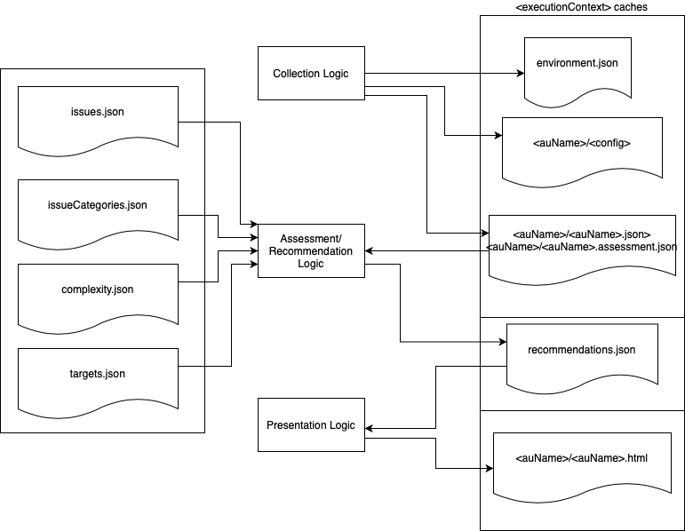

# Transformation Advisor SDK Plugin Developer Guide

This document provides a step by step guide for developers to use the Transformation Advisor(TA) SDK to develop new middleware plug-inswhich can be used standalone or in conjunction with IBM Cloud Transformation Advisor

### Prereqs
The TA SDK requires Java, git and maven.  You need to install these on your development environment.

In this document we use IntelliJ as the Java development tool.

### Steps
1.  Create a maven project in IntelliJ,  which will automatically generate the pom.xml file for you.

2.  Add the TA SDK dependency to your project's pom.xml file.
```
    <dependencies>
        <dependency>
            <groupId>com.ibm.ta.sdk</groupId>
            <artifactId>ta-sdk-core</artifactId>
            <version>0.5.2-2</version>
        </dependency>
    </dependencies>
```

   Then click the `Import All Maven Projects` button in the Maven Tool Panel.  

If the specific version of the TA SDK cannot be found in the maven central repository,  you can clone the [TA SDK Repo](https://github.com/IBM/transformation-advisor-sdk) and build the jar files locally.

The following commands will build the TA SDK.
Once the build completes the TA SDK jar files will be stored in your local maven repository, by default it will in the ~/.m2/repository/ directory.
```
git clone https://github.com/IBM/transformation-advisor-sdk.git
cd transformation-advisor-sdk/
mvn clean install
```

4.  Add plug-in build and steps to your project's pom.xml file.

    This build step will include your plug-in class and all it dependencies in an executable jar file that can be invoked directly.  The output jar file will be in your project's `target` directory.

    You can just add this part to your project's pom.xml file:
```
    <build>
        <plugins>
            <plugin>
                <groupId>org.apache.maven.plugins</groupId>
                <artifactId>maven-compiler-plugin</artifactId>
                <configuration>
                    <source>8</source>
                    <target>8</target>
                </configuration>
            </plugin>
            <plugin>
                <groupId>org.apache.maven.plugins</groupId>
                <artifactId>maven-assembly-plugin</artifactId>
                <version>3.1.1</version>
                <executions>
                    <execution>
                        <id>make-assembly</id>
                        <phase>package</phase>
                        <goals>
                            <goal>single</goal>
                        </goals>
                        <configuration>
                            <archive>
                                <manifest>
                                    <addClasspath>true</addClasspath>
                                    <mainClass>com.ibm.ta.sdk.spi.plugin.TADataCollector</mainClass>
                                </manifest>
                            </archive>
                            <descriptorRefs>
                                <descriptorRef>jar-with-dependencies</descriptorRef>
                            </descriptorRefs>
                            <appendAssemblyId>false</appendAssemblyId>
                        </configuration>
                    </execution>
                </executions>
            </plugin>
        </plugins>
    </build>
```

5.  Create the plug-in config file.

    Create a `META-INF/services/com.ibm.ta.sdk.spi.plugin.PluginProvider`  file under your project's `src/main/resources/` directory, the content of this file is just the full class name of your new plug-in java file.


6.  Create your skeleton plug-in Java class.
    
    Your plug-in class needs to implement the `PluginProvider` interface. To simplify this process you can extend the TA SDK's `GenericPluginProvider` class.

    In this sample java code,  only the implementation of getMiddleware() and getDomain() methods has been customized:
```
package com.ibm.ta.sdk.demo;

                             
import com.ibm.ta.sdk.core.plugin.GenericPluginProvider;
import com.ibm.ta.sdk.spi.collect.DataCollection;
import com.ibm.ta.sdk.spi.plugin.CliInputCommand;
import com.ibm.ta.sdk.spi.collect.EnvironmentJson;
import com.ibm.ta.sdk.spi.plugin.TAException;
import com.ibm.ta.sdk.core.collect.GenericAssessmentUnit;
import com.ibm.ta.sdk.core.collect.GenericDataCollection;

import java.util.Arrays;
import java.util.ArrayList;
import java.util.List;
import java.nio.file.Path; 
import java.io.IOException;
import java.net.URISyntaxException;
                               
public class DemoPlugin extends GenericPluginProvider {

    @Override
    public String getDomain() {
        return "Plugin-Demo";
    }

    @Override
    public String getMiddleware() {
        return "demo";
    }

    @Override
    public CliInputCommand getCollectCommand() {
        return null;
    }
    
    @Override
    public List<DataCollection> getCollection(CliInputCommand cliInputCommand) throws TAException {
        return null;
    }
}
```

7.  Build and test the skeleton plug-in.

    You can run the build command `mvn clean package` in your project's root dir to build your project.  The build should complete successfully,  and you can find the jar file in the target/ dir.

    You can run the help command against your plug-in jar and see this output message to indicate the plug-in for middleware `demo` is available.
```
# java -jar target/ta-sdk-demo-1.0-SNAPSHOT.jar --help

Usage: TADataCollector MIDDLEWARE COMMAND [OPTIONS]

Middleware:
  Plug-ins available for these middleware [ demo ]

Commands:
  help      Get information on the commands and options available for a middleware
```

8.  Add plug-in specific command help.
    
    Each data collector plug-in supports the `collect`, `assess`, and `report` commands.

    Collect - Gathers installation and configuration information about the middleware and its instances. This data must be free of sensitive information, such as passwords, as this data could be packaged and copied to external systems. 

    Assess - The collected data is used as input to the `assess` command, which parses the data looking for issues. The output from the `assess` command is a recommendations.json. The recommendations.json file contains a list of issues identified by the recommendations logic. In addition to metadata that describes the issue, each issue also includes cost information, severity, complexity and information on how to resolve it. 

    Report - Parses the recommendations.json and generates reports from it. There is currently only support for HTML reports. The report presents a more user friendly and readable version of recommendations.json.

    The options for these commands are defined in the getXXXCommand() method,  when user type the --help for different command,  the plug-in specific command option will be displayed.
  
    
    
    This diagram illustrates the the function of each command and the interaction/flow between these commands.

    The GenericPluginProvider provide the default implementation for the assess and report method, in here we just implement the collect method.  The collect command take one parameter,  which is the install path of your demo software.

    Let us replace the ` getCollectCommand() ` methods with the following code. 
```
    @Override
    public CliInputCommand getCollectCommand() {
        CliInputCommand collectCmd = new CliInputCommand(CliInputCommand.CMD_COLLECT,
                "Performs data collection for middleware demo",
                null, null, Arrays.asList("INSTALL_PATH"));
        return collectCmd;
    }
```
    
   Then run the build command ` mvn clean package `,  and test it,  you will see you description of these command displayed.

```
# java -jar target/ta-sdk-demo-1.0-SNAPSHOT.jar demo help

Usage: TADataCollector demo COMMAND [OPTIONS]

Commands:
  collect        Performs data collection middleware demo
  assess         Performs data collection and assessment
  report         Generate reports
  run            Performs data collection, assessment, and generate reports


Run 'TADataCollector MIDDLEWARE COMMAND --help' for more information on a command.

# java -jar target/ta-sdk-demo-1.0-SNAPSHOT.jar demo collect --help

Usage: TADataCollector demo collect INSTALL_PATH

Run 'TADataCollector MIDDLEWARE COMMAND --help' for more information on a command.
```

9.  Add the business logic in the collect command
    
    In the collect() method,  you add your middleware specific business logic to detect your relevant product information, and use this information to generate the environment object,  which represents the server environment your product is running on.  You can create multiple collections for a given environment.  Each collection can contain multiple assessment units.  The assessmentUnit is the actual item you wish to modernise. For example consider  the WebSphere Application Server case:
 - You gather your environment information for the server instance
 - The collection will be the WAS profile 
 - The assessment unit is a deployed application.   

You expect that the WebSphere profile will run multiple applications and so there will be multiple assessmentUnits. For each assessment unit,  you need to generate a data file.  This data file will be used in the assess() command to generate the recommendations. To simplify the process for this doc we just prepared the data file and put is under the resource directory.

You can replace the collect() method with the following code:
```
    @Override
    public List<DataCollection> getCollection(CliInputCommand cliInputCommand) throws TAException {
        String instanceName = "instance1";
        EnvironmentJson envJson = new EnvironmentJson("Plugin-Demo", "demo", "1.0.0");
        envJson.setMiddlewareInstallPath(cliInputCommand.getArguments().get(0));
        envJson.setAssessmentType("Instance");
        envJson.setAssessmentName(instanceName);
        try {
            Path assessDataJsonFile = getFileFromUri(DemoPlugin.class.getResource("/sampleData/application1.json").toURI());
            List<GenericAssessmentUnit> auList = new ArrayList<>();
            auList.add(super.getAssessmentUnit(null, assessDataJsonFile, null));
            GenericDataCollection coll = new GenericDataCollection(instanceName, envJson, auList);
            List<DataCollection> colls = new ArrayList<>();
            colls.add(coll);
            return colls;
        } catch (URISyntaxException e) {
            throw new TAException(e);
        } catch (IOException e) {
            throw new TAException(e);
        }
    }
```

Create the `/sampleData/application1.json` file under under your project's `src/main/resources/` directory using this content.
```
{
  "metadata_version": "1.0.0.0",
  "name": "NewYork",
  "version": "8.0.0.9",
  "chadexit": "",
  "clwlexit": "",
  "connAuth": "SYSTEM.DEFAULT.AUTHINFO.IDPWOS",
  "clusters": [
    {
      "name": "INVENTORY",
      "fullRepository": true
    }
  ]
}
```
   Then run the build command: ` mvn clean package `   
   Test it using this command:
```java -jar target/ta-sdk-demo-1.0-SNAPSHOT.jar demo collect /opt/DemoSoftware```     
   You will see the environment.json file created under the output directory and the assessment unit's data file application1.json also copied to the output directory.


10. Create the issues, complexity, category and target json files

    In the assess() command,  the TA SDK will generate the recommendations file based on the issues detected in the assessment unit's data file and config files,  you need to create a set of issue files under the `src/main/resources/<middlewareName>` directory.

    Create the complexity.json file using this content:
```
[
  {
    "id": "dns",
    "name": "DNS Reconfiguration",
    "description": "Issues that require DNS reconfiguration",
    "complexityContribution": "SIMPLE",
    "issues": [
      "MQCL01"
    ]
  },
  {
    "id": "cluster",
    "name": "Cluster Reconfiguration",
    "description": "Issues that require cluster reconfiguration",
    "complexityContribution": "MODERATE",
    "issuesCategory": [
      "cluster"
    ]
  },
  {
    "id": "security",
    "name": "Client authentication reconfiguration",
    "description": "Issues that require client authentication reconfiguration",
    "complexityContribution": "COMPLEX",
    "issues": [
      "MQSEC01"
    ]
  }
]
```

   Create the issue.json file using this content:
```
[
  {
    "id": "MQCL03",
    "title": "Contains a Full Repository.  Assess impact to other cluster members.",
    "category": "cluster",
    "issueOverhead": 0.5,
    "occurrencesCost": 0.5,
    "solutionText": [
      "Update other Cluster members using IPAddresses to use the new IPAddress after migrating"
    ],
    "severity": "YELLOW",
    "matchCriteria": {
      "ruleType": "json",
      "jsonQueryPath": {
        "fullRepository": "$.clusters[?(@.fullRepository == true)]"
      },
      "occurrenceAttr": {
        "cluster": {
          "title": "Cluster",
          "path": "name"
        }
      }
    }
  },
  {
    "id": "MQEXIT01",
    "title": "Channel Exits defined. Review whether usage affects your MQ deployment architecture when migrating.",
    "category": "exits",
    "issueOverhead": 1.0,
    "occurrencesCost": 1.0,
    "solutionText": [
      "Scenarios:",
      "(1) Custom Exit binary is redundant.",
      "Check if Exit has been replaced with Product Capability in MQ 9 and adopt that instead.",
      "(2) Exit is connecting to an external system.",
      "Examine configuration for your Queue Manager looking for connection parameters (environment variables and/or config files).  If found, consider how you will manage this dependency in your DevOps pipeline. Also ensure that connectivity can be established from new target k8 cluster",
      "(3) Exit will be carried forward as-is in your migrated Queue Manager.",
      "Embed the binaries into the new Docker container.  Check to see if binaries need to be ported to run in your desired Container Base OS and target cluster architecture."
    ],
    "severity": "YELLOW",
    "matchCriteria": {
      "ruleType": "json",
      "jsonQueryPath": {
        "msgexit": "$.channels[?(@.msgexit empty false && @.type nin [7,8,9])]",
        "msgretryexit": "$.channels[?(@.msgretryexit empty false && @.type nin [7,8,9])]",
        "rcvexit": "$.channels[?(@.rcvexit empty false && @.type nin [7,8,9])]",
        "scyexit": "$.channels[?(@.scyexit empty false && @.type nin [7,8,9])]",
        "sendexit": "$.channels[?(@.sendexit empty false && @.type nin [7,8,9])]"
      },
      "occurrenceAttr": {
        "channel": {
          "title": "Channel",
          "path": "name"
        },
        "exitType": {
          "title": "Exit Type",
          "path": "@filterPathKey"
        },
        "exitName": {
          "title": "Exit Name",
          "path": "@filterPathKeyValue",
          "countUnique": true
        }
      }
    }
  }
]

```
   
   Create the issue-category.json file using this content:
```
{
  "security": {
    "title": "Authentication considerations"
  },
  "exits": {
    "title": "Exit and custom binary considerations"
  },
  "cluster": {
    "title": "Cluster considerations"
  }
}
```

   Create the target.json file using this content:
```
{
  "productName": "DemoOnCloud",
  "productVersion": "19.0.0",
  "runtime": "ACE"
}
```


11.  Test the assess() command

   After creating all 4 json files run the build command: ` mvn clean package `     
   Test it using this command:
```
java -jar target/ta-sdk-demo-1.0-SNAPSHOT.jar demo assess /opt/DemoSoftware   
```
You should see that the recommendations.json file is created under the output directory,  and an archive file for this collection is also generated.


12.  Test the report command
    
   Run this command:
```
java -jar target/ta-sdk-demo-1.0-SNAPSHOT.jar demo report   
```
The command should complete successfully,  and you will see the recommendations_Private_Docker.html file in the output/instance1/application1/ directory.


13.  Test the run command
    
   The `run` command is just a wrapper,  it will invoke the collect(),  assess() and report() command sequentially.
```
rm -rf output/
java -jar target/ta-sdk-demo-1.0-SNAPSHOT.jar demo run /opt/DemoSoftware
```

   You can check that all the files are generated under the output/ directory.


Here is the source files for this demo project

[ta-sdk-demo.zip](files/ta-sdk-demo.zip)
